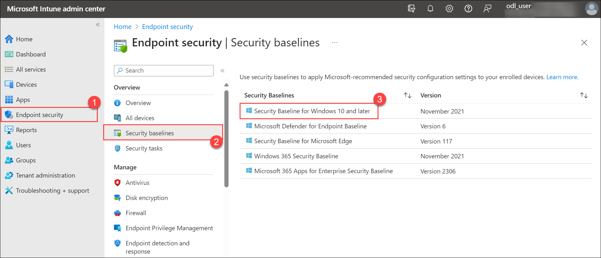
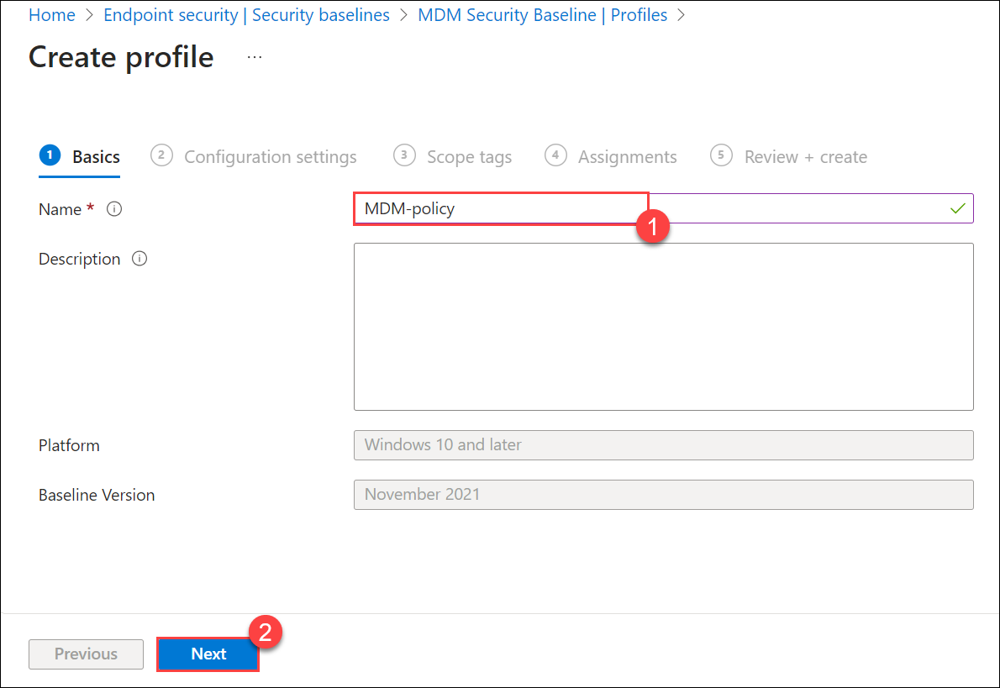

# Lab 01 - Implement Microsoft Defender for Endpoint

## Lab overview

In this lab, participants will immerse themselves in the practical implementation of Microsoft Defender for Endpoint. The primary goal is to equip participants with the skills and knowledge necessary to fortify the security infrastructure of organizational endpoints.

## Lab scenario

The objective of this lab is to provide a hands-on experience in setting up and configuring Microsoft Defender for Endpoint, a comprehensive endpoint security solution. Participants will learn how to enhance the security posture of their organization's endpoints by implementing various features and policies offered by Defender for Endpoint.

- **Hands-On Experience**: Participants will actively engage with the Microsoft Defender for Endpoint platform, gaining practical experience in the setup and configuration processes. This hands-on approach allows them to familiarize themselves with the actual steps involved in deploying and managing Defender for Endpoint.

- **Understanding Endpoint Security**: The lab emphasizes the significance of endpoint security, highlighting Defender for Endpoint as a robust solution. Participants will delve into the functionalities and capabilities of the platform, understanding how it plays a pivotal role in safeguarding organizational endpoints.

- **Comprehensive Security Solution**: Defender for Endpoint is positioned as a comprehensive security solution. Throughout the lab, participants will explore the diverse features and components that contribute to its comprehensive nature. This includes aspects such as threat detection, response mechanisms, and integration with other security tools.

## Lab objectives

In this lab, you will perform the following:

- Task 1: Setup Defender for Endpoint  
- Task 2: Configure Roles
- Task 3: Configure Device Groups
- Task 4: Create Baseline Policies

## Architecture Diagram

  

### Task 1: Setup Defender for Endpoint  

In this task, you will perform the initialization of the Microsoft Defender for the Endpoint portal.

1. Inside the Lab-VM, select **Type here to search**, search for **Microsoft Edge** and select it.

1. In the Edge browser, navigate to the [Microsoft Defender portal](https://security.microsoft.com).

1. In the **Sign in** dialog box, copy and paste Email/Username: <inject key="AzureAdUserEmail"></inject> and then select Next.

1. In the **Enter password** dialog box, copy and paste Password: <inject key="AzureAdUserPassword"></inject> and then select **Sign in**.

1. On the **Microsoft Defender** portal, from the left-navigation menu, select **Settings (1)** from the left.

1. On the **Settings** page select **Device discovery (2)**. 

    

    >**Note:** If you do not see the **Device discovery** option under **Settings**, log out by selecting the top-right circle with your account initials and select **Sign out**. Other options that you might want to try are to refresh the page, wait for 20-25 minutes or open the page InPrivate. Login again with the **Tenant Email** credentials.

1. In the Discovery setup make sure **Standard discovery (recommended)** is selected. 
    >**Hint:** If you do not see the option, refresh the page.

    
### Task 2: Configure Roles

In this task, you will configure roles for use with device groups.

1. Sign in to the [Azure portal](https://portal.azure.com).

1. In the **Sign in** dialog box, copy and paste in the **Username** provided in the environment details page (odl_user_DID@xxxxx.onmicrosoft.com) and then select Next.

1. In the **Enter password** dialog box, copy and paste in the Password and then select **Sign in**.

1. On the **Stay signed in?** dialog box, select the Don’t show this again check box and then select **No**.

1. In the Search bar of the Azure portal, type **Microsoft Entra ID**, then select Microsoft Entra ID.

1. Select **Groups** and then click on **New group**.

1. Enter the below details for the New group page:

   |Setting|Value|
    |---|---|
    |Group Type| **Microsoft 365** |
    |Group Name| **Sg-IT** |
    |Microsoft Entra roles can be assigned to the group| **Yes** |

1. Click on **No owners selected** and select the **ODL_user <inject key="DeploymentID" enableCopy="false"/>** from the list and then click on **select**.

1. Click on **No members selected** and select the **ODL_user <inject key="DeploymentID" enableCopy="false"/>** from the list and then click on **select**.

   **Note**: Make sure you have selected **Group type** as Microsoft 365.

1. Select **Create** and click on **Yes**. 

1. In the Microsoft Defender portal select **Settings** from the left menu bar, then select **Endpoints**. 

1. Select **Roles** under the permissions area.

1. Select the **Turn on roles** button.

1. Select **+ Add Role**. by clicking three dots

1. In the Add role dialog enter the following:

    |General setting|Value|
    |---|---|
    |Role name|**Tier 1 Support**|
    |Permissions|Live Response capabilities - Advanced|

1. Select the **Assigned user groups** by click on next. Select **sg-IT** and then select **Add selected groups**. Make sure it appears under *Azure AD user groups with this role*.

1. Select **Submit** and Done. If you receive an error while saving the role, refresh the page and try again.

### Task 3: Configure Device Groups

In this task, you will configure device groups that allow for access control and automation configuration.

1. In the Microsoft Defender portal select **Settings** from the left menu bar, then select **Endpoints**. 

1. Select **Device groups** under the permissions area.

1. Select **+ Add device group** icon.

1. Enter the following information on the General tab:

    |General setting|Value|
    |---|---|
    |Device group name|**Regular**|
    |ReMediation level| Full-ReMediate threats automatically|

1. Select **Next**.

1. On the Devices tab, for the OS condition select **Windows 10** and select **Next**.

1. On the Preview devices tab, select **Next**.

1. For the User access tab, select **sg-IT** and then select **Add selected groups** button. Make sure it appears under **Azure AD user groups with access to this device group**.

1. Select **submit**

1. Select **Done**.

1. Device group configuration has changed. Select **Apply changes** to check matches and recalculate groupings.

1. You are going to have two device groups now; the **Regular** you just created and the **Ungrouped devices (default)** with the same reMediation level.

### Task 4: Create Baseline Policies

The Windows Intune security baseline provides a comprehensive set of recommended settings needed to securely configure devices running Windows, including browser settings, PowerShell settings, and settings for some security features like Microsoft Defender Antivirus.

1. Open another tab and browse to the [Microsoft Intune admin center](intune.microsoft.com).

1. From the left navigation pane, select **Endpoint security(1)**, under **Overview** section, select **Security Baselines (2)**.

1. On the **Endpoint security | Security baselines**, select **Security Baseline for Windows 10 and later (3)**.

    

1. On the **MDM Security Baseline | Profiles** page, select **Create profile**.

    .png)

1. On the **Create profile** page, under the **Basics** tab, enter any **name (1)** of your choice and **description (optional)**, then select **Next (2)**.

    

1. On the **Configuration settings** tab, review all configurations by expanding each one. If you want to edit any of the configurations, feel free to make your changes. Select **Next**.

1. Keep the **Scope tags** tab as default, select **Next**.

1. On the **Assignments** tab, under **Included groups**, select **Add groups**, on the **Select groups to include** page, choose **Sg-IT**, and click on **Select**. Select **Next**.

1. On the **Review + create** page, select **Create**.

1. After the policy is created, you will be able to view it in the **MDM Security Baseline | Profiles section**.

    

## Review
In this lab, you have completed the following:

- Setup Defender for Endpoint 
- Configured Roles
- Configured Device Groups
- Created Baseline Policies

## You have successfully completed the lab.
