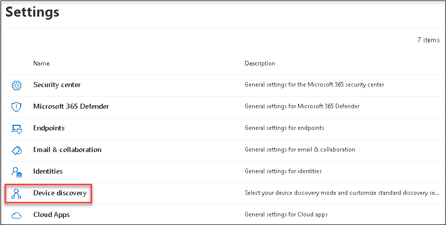

# Lab 01 - Deploy Microsoft Defender for Endpoint

## Lab scenario

You are a Security Operations Analyst working at a company that is implementing Microsoft Defender for Endpoint. Your manager plans to onboard a few devices to provide insight into required changes to the Security Operations (SecOps) team response procedures.

You start by initializing the Defender for the Endpoint environment. Next, you onboard the initial devices for your deployment by running the onboarding script on the devices. You configure security for the environment. Lastly, you create Device groups and assign the appropriate devices.

>**Important:**  The lab Virtual Machines are used through different modules. SAVE your virtual machines. If you exit the lab without saving, you will be required to re-run some configurations again.

## Lab objectives (Duration: 60 minutes)
In this lab, you will perform the following:
- Task 1: Preparing the Microsoft Defender workspace
- Task 2: Initialize Microsoft Defender for Endpoint
- Task 3: Configure Roles
- Task 4: Configure Device Groups

## Architecture Diagram

  

### Task 1: Initialize Microsoft Defender for Endpoint

In this task, you will perform the initialization of the Microsoft Defender for the Endpoint portal.

1. If you are not already at the Microsoft Defender portal, start the Microsoft Edge browser.

1. In the Edge browser, go to the Microsoft Defender portal at (https://security.microsoft.com).

1. In the **Sign in** dialog box, copy and paste Email/Username: <inject key="AzureAdUserEmail"></inject> and then select Next.

1. In the **Enter password** dialog box, copy and paste Password: <inject key="AzureAdUserPassword"></inject> and then select **Sign in**.

1. On the **Microsoft Defender** portal, from the navigation menu, select **Settings** from the left.

1. On the **Settings** page select **Device discovery**. 

    

    >**Note:** If you do not see the **Device discovery** option under **Settings**, log out by selecting the top-right circle with your account initials and select **Sign out**. Other options that you might want to try are to refresh the page, wait for 20-25 minutes or open the page InPrivate. Login again with the **Tenant Email** credentials.

1. In the Discovery setup make sure **Standard discovery (recommended)** is selected. 
    >**Hint:** If you do not see the option, refresh the page.

    
### Task 3: Configure Roles

In this task, you will configure roles for use with device groups.

1. Sign in to the [Azure portal](https://portal.azure.com).

1. In the **Sign in** dialog box, copy and paste in the **Username** provided in the environment details page (odl_user_DID@xxxxx.onmicrosoft.com) and then select Next.

1. In the **Enter password** dialog box, copy and paste in the Password and then select **Sign in**.

1. On the **Stay signed in?** dialog box, select the Don’t show this again check box and then select **No**.

1. In the Search bar of the Azure portal, type **Microsoft Entra ID**, then select Microsoft Entra ID.

1. Select **Groups** and then click on **New group**.

1. Enter the below details for the New group page:

   |Setting|Value|
    |---|---|
    |Group Type| **Microsoft 365** |
    |Group Name| **Sg-IT** |
    |Microsoft Entra roles can be assigned to the group| **Yes** |

1. Click on **No owners selected** and select the **ODL_user <inject key="DeploymentID" enableCopy="false"/>** from the list and then click on **select**.

1. Click on **No members selected** and select the **ODL_user <inject key="DeploymentID" enableCopy="false"/>** from the list and then click on **select**.

   **Note**: Make sure you have selected **Group type** as Microsoft 365.

1. Select **Create** and click on **Yes**. 

1. In the Microsoft Defender portal select **Settings** from the left menu bar, then select **Endpoints**. 

1. Select **Roles** under the permissions area.

1. Select the **Turn on roles** button.

1. Select **+ Add Role**. by clicking three dots

1. In the Add role dialog enter the following:

    |General setting|Value|
    |---|---|
    |Role name|**Tier 1 Support**|
    |Permissions|Live Response capabilities - Advanced|

1. Select the **Assigned user groups** by click on next. Select **sg-IT** and then select **Add selected groups**. Make sure it appears under *Azure AD user groups with this role*.

1. Select **Submit** and Done. If you receive an error while saving the role, refresh the page and try again.

### Task 4: Configure Device Groups

In this task, you will configure device groups that allow for access control and automation configuration.

1. In the Microsoft Defender portal select **Settings** from the left menu bar, then select **Endpoints**. 

1. Select **Device groups** under the permissions area.

1. Select **+ Add device group** icon.

1. Enter the following information on the General tab:

    |General setting|Value|
    |---|---|
    |Device group name|**Regular**|
    |ReMediation level| Full-reMediate threats automatically|

1. Select **Next**.

1. On the Devices tab, for the OS condition select **Windows 10** and select **Next**.

1. On the Preview devices tab, select **Next**.

1. For the User access tab, select **sg-IT** and then select **Add selected groups** button. Make sure it appears under **Azure AD user groups with access to this device group**.

1. Select **submit**

1. Select **Done**.

1. Device group configuration has changed. Select **Apply changes** to check matches and recalculate groupings.

1. You are going to have two device groups now; the **Regular** you just created and the **Ungrouped devices (default)** with the same reMediation level.

## Review
In this lab, you will perform the following:
- Preparing the Microsoft 365 Defender workspace
- Initialize Microsoft Defender for Endpoint
- Configure Roles
- Configure Device Groups
