# Lab 05 - Configure & Test Defender for Endpoint capabilities

## Lab overview

The objective of this lab is to provide a hands-on experience in configuring and testing the capabilities of Microsoft Defender for Endpoint. Participants will engage in setting up Defender for Endpoint on Windows client devices, configuring various security policies, and testing its threat detection and response capabilities. Through practical exercises, participants will gain insights into enhancing endpoint security, ensuring compliance, and effectively mitigating potential threats using Defender for Endpoint features.

## Lab scenario

- Create Attack Surface Reduction Rules: Participants will learn the process of creating rules for attack surface reduction.
Understanding how to limit the attack surface and mitigate potential security risks is a key objective.

- Configure Web Content Filtering: The lab guides participants in configuring web content filtering policies. Understanding the importance of controlling web content access and implementing appropriate filtering measures.

- Testing Web Content Filtering Policy: Practical scenarios will be simulated to test the effectiveness of web content filtering policies.
Participants will actively assess the impact of configured policies on web content access.

- Explore Automatic Investigation and Response (AIR): Participants will explore the capabilities of Automatic Investigation and Response (AIR).
Understanding how automated response mechanisms can enhance incident detection and response.

## Lab objectives

In this lab, you will perform the following:

- Task 1: Create Attack Surface Reduction Rules  
- Task 2: Configure Web Content Filtering 
- Task 3: Testing Web Content Filtering policy 
- Task 4: Explore Automatic Investigation and response (AIR)  

## Architecture Diagram

  

### Task 1: Create Attack Surface Reduction Rules 

1. Open the [Microsoft Intune admin center](https://go.microsoft.com/fwlink/?linkid=2109431).

1. From the left-navigation menu select, **Endpoint Security**. On the **Endpoint security | Overview** page, from the left-navigation menu select **Attack surface reduction**.

1. Select **+ Create Policy**.

1. On **Create a profile** page, under **Platform** select **Windows 10, Windows 11, and Windows Server (1)**, and in **Profile**, select **Attack surface reduction rules (2)**.

    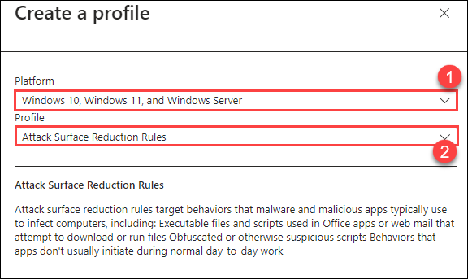

1. Select **Create**.

1. In the Basics tab of the **Create profile** pane, in **Name** add a name for your policy. In **Description** add a description for your ASR rules policy.

1. In the **Configuration settings** tab, under **Attack Surface Reduction Rules**, follow these instructions, and select **Next**:

    |Settings|Value|
    |--------|-----|
    |Block Adobe Reader from creating child processes|Audit|
    |Block execution of potentially obfuscated scripts|Audit|
    |Block Win32 API calls from Office macros|Audit|
    |Block credential stealing from the Windows local security authority subsystem|Audit|
    |Block executable files from running unless they meet a prevalence, age, or trusted list criterion|Audit|
    |Block JavaScript or VBScript from launching downloaded executable content|Audit|
    |Block Office communication application from creating child processes|Audit|
    |Block all Office applications from creating child processes|Audit|
    |Block Webshell creation for Servers|Audit|
    |Block untrusted and unsigned processes that run from USB|Audit|
    |Block process creations originating from PSExec and WMI commands|Audit|
    |Block persistence through WMI event subscription|Audit|
    |Block Office applications from creating executable content|Audit|
    |Block Office applications from injecting code into other processes|Audit|
    |Use advanced protection against ransomware|Audit|
    |Block executable content from email client and webmail|Audit|
    |Block abuse of exploited vulnerable signed drivers (Device)|Audit|
    |Enable Controlled Folder Access|Audit Mode|

1. In the **Scope tags** pane, keep everything as default and select **Next**.

    >**Note:** you can add tag information to specific devices. You can also use role-based access control and scope tags to make sure that the right admins have the right access and visibility to the right Intune objects. Learn more: Use role-based access control (RBAC) and scope tags for distributed IT in Intune.

1. In the **Assignments** pane, you can deploy or "assign" the profile to your user or device groups. Under **Included groups** select **Add groups** and selct the **Sg-IT** group that you created in Lab-01, select **Next**.

1. Now, review your settings in the **Review + create** pane. Click **Create** to apply the rules.

1. Your new attack surface reduction policy for ASR rules is listed in **Endpoint security | Attack surface reduction**.

    

### Task 2: Configure Web Content Filtering

1. Open [Microsoft Defender](https://go.microsoft.com/fwlink/p/?linkid=2077139) portal and sign in.

1. In the navigation pane, select **Settings > Endpoints > General > Advanced Features**.

1. Scroll down until you see **Web content filtering**.

1. Switch the toggle to **On**, and then select **Save preferences**.

    >**Note:** If it is On, the toggle button will not be visible to you; you can move on to the next step.

1. Open another tab, and open [Microsoft Intune Admin Center](https://intune.microsoft.com/#home).

1. From the left navigation pane, select **Endpoint security (1)**. On **Endpoint security | Overview** page, from the left navigation menu select **Antivirus (2)**.

    

1. Select **+ Create Policy**. On **Create a profile** page, select **Windows 10, Windows 11 and Windows Server (1)**, under **Platform**, and select **Microsoft Defender Antivirus (2)** under **Profile**. Select **Create**.

    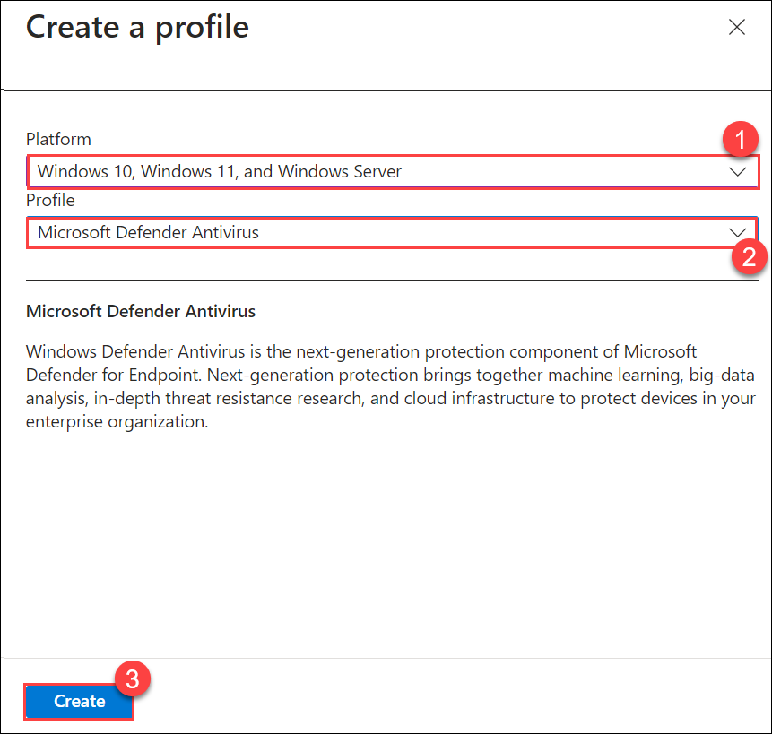

1. On **Create profile** page, give the name of your choice, and select **Next**.

1. In **Configuration settings**, enabling network protection and choice **Audit mode (6)** for testing the feature, and select **Next (8)**.

    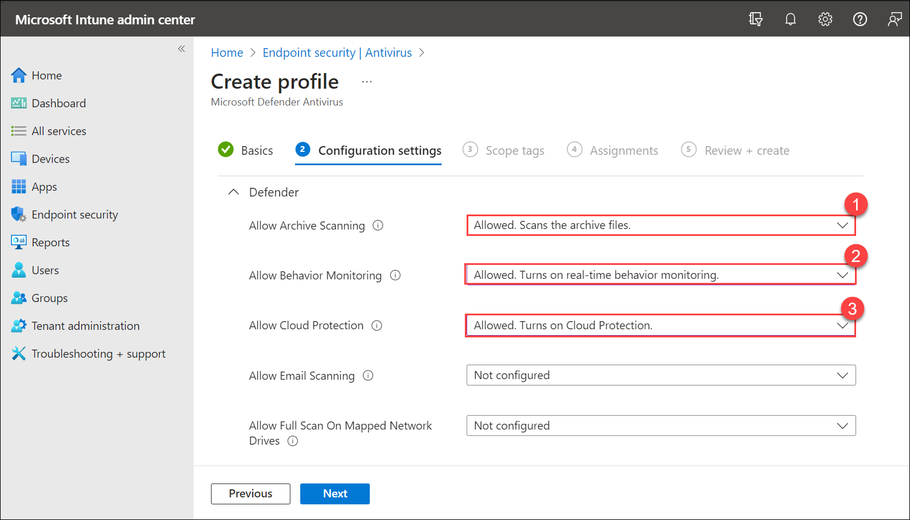

    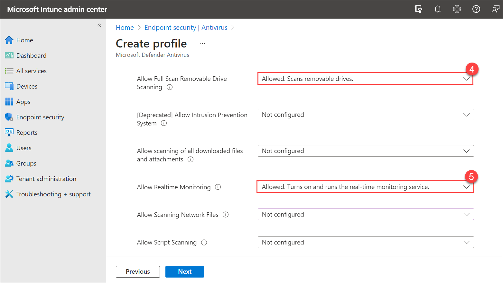

    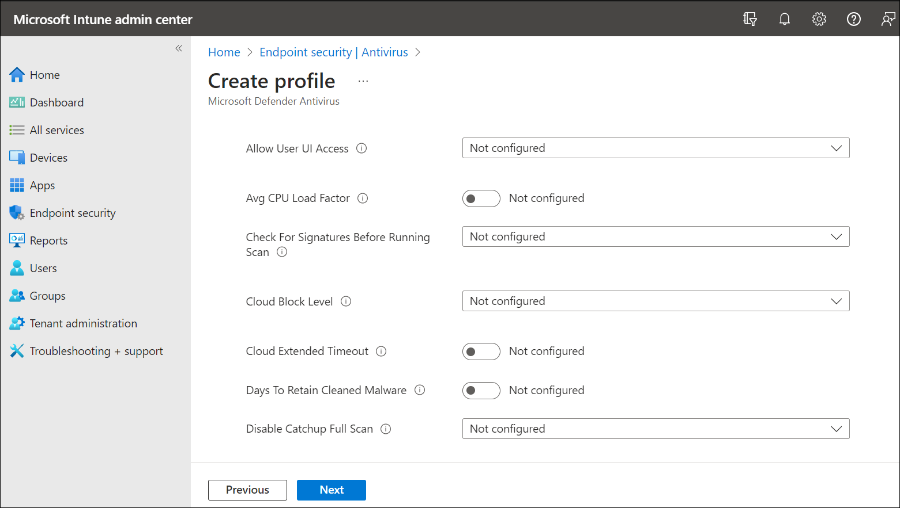

    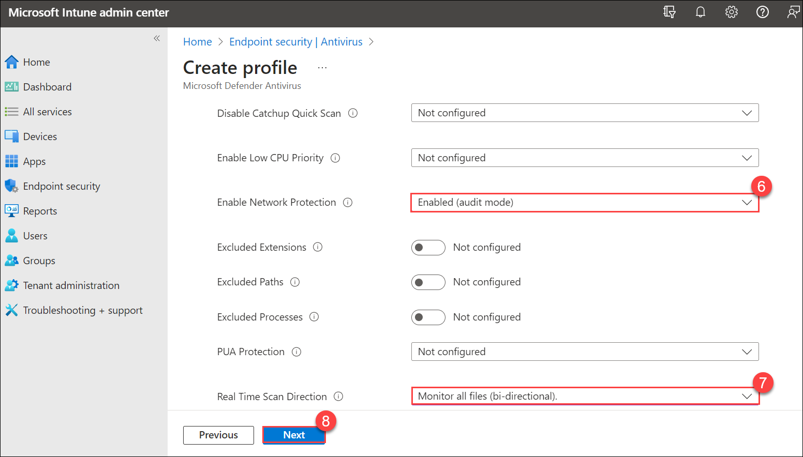

1. Inside your Lab-VM, in **Type here to search** search for **Windows PowerShell**, right-click on it and Select **Run as administrator**. Run these commands to enable block mode and audit mode.

    ```powershell
    Set-MpPreference -EnableNetworkProtection Enabled
    ```

    ```powershell
    Set-MpPreference -EnableNetworkProtection AuditMode
    ```

1. Now, navigate back to the Microsoft Defender portal, choose **Settings > Endpoints > Web content filtering > + Add policy**.

1. On the **Add Policy** page, under **General Details**, provide a **Policy name (1)** of your choice, and select **Next (2)**.

    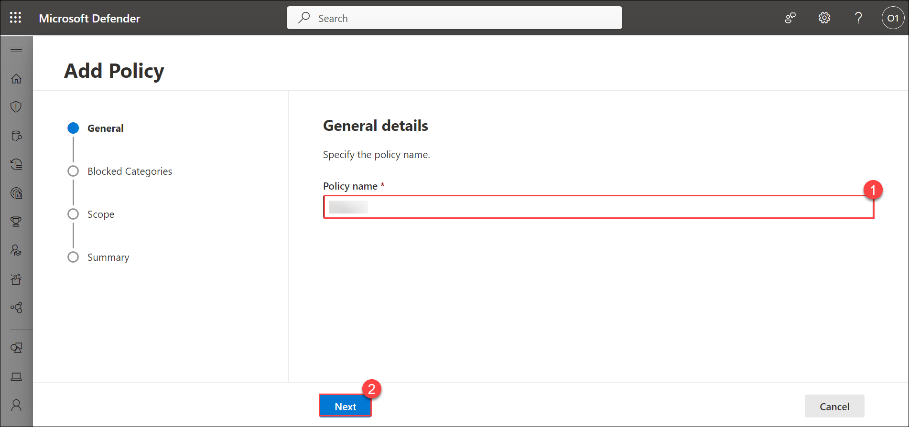

1. On **Blocked Categories** page, select the categories to block, select specific web content categories, and select **Next**.

    >**Note:** 
    > Web content filtering policies specify which site categories are blocked on which device groups.
    -  Policies can be deployed to block any of the following parent or child categories:

        |**Parent category**|**Child categories**|
        |-------------------|--------------------|
        |**Adult content**|- **Cults**: Sites related to groups or movements whose members demonstrate passion for a belief system that is different from those that are socially accepted.
        || - **Gambling**: Online gambling and sites that promote gambling skills and practice.
        ||- **Nudity**: Sites that provide full-frontal and semi-nude images or videos, typically in artistic form, and might allow the download or sale of such materials.
        ||- **Pornography / Sexually explicit**: Sites containing sexually explicit content in an image-based or textual form. Any form of sexually oriented material is also listed here.
        ||- **Sex education**: Sites that discuss sex and sexuality in an informative and non-voyeuristic way, including sites that provide education about human reproduction and contraception, sites that offer advice on preventing infection from sexual diseases, and sites that offer advice on sexual health matters.
        ||- **Tasteless**: Sites oriented towards content unsuitable for school children to view or that an employer would be uncomfortable with their staff accessing, but not necessarily violent or pornographic.
        ||- **Violence**: Sites that display or promote content related to violence against humans or animals.
        |**High bandwidth**|- **Download sites**: Sites whose primary function is to allow users to download media content or programs, such as computer programs.
        ||- **Image sharing**: Sites that are used primarily for searching or sharing photos, including those that have social aspects.
        ||- **Peer-to-peer**: Sites that host peer-to-peer (P2P) software or facilitate the sharing of files using P2P software.
        ||- **Streaming media & downloads**: Sites whose primary function is the distribution of streaming media, or sites that allow users to search, watch, or listen to streaming media.
        |**Legal liability**|- **Child abuse images**: Sites that include child abuse images or pornography.
        ||- **Criminal activity**: Sites that give instruction on, advice about, or promotion of illegal activities.
        ||- **Hacking**: Sites that provide resources for illegal or questionable use of computer software or hardware, including sites that distribute copyrighted material that has been cracked.
        ||- **Hate & intolerance**: Sites promoting aggressive, degrading, or abusive opinions about any section of the population that could be identified by race, religion, gender, age, nationality, physical disability, economic situation, sexual preferences or any other lifestyle choice.
        ||- **Illegal drug**: Sites that sell illegal/controlled substances, promote substance abuse, or sell related paraphernalia.
        ||- **Illegal software**: Sites that contain or promote the use of malware, spyware, botnets, phishing scams, or piracy & copyright theft.
        ||- **School cheating**: Sites related to plagiarism or school cheating.
        ||- **Self-harm**: Sites that promote self-harm, including cyberbullying sites that contain abusive and/or threatening messages towards users.
        ||- **Weapons**: Any site that sells weapons or advocates the use of weapons, including but not limited to guns, knives, and ammunition.|
        |**Leisure**| - **Chat**: Sites that are primarily web-based chat rooms.
        ||- **Games**: Sites relating to video or computer games, including sites that promote gaming through hosting online services or information related to gaming.
        ||- **Instant messaging**: Sites that can be used to download instant messaging software or client based instant messaging.
        ||- **Professional network**: Sites that provide professional networking services.
        ||- **Social networking**: Sites that provide social networking services.
        ||- **Web-based email**: Sites offering web-based mail services.|
        |**Uncategorized**|	- **Newly registered domains**: Sites that have been newly registered in the past 30 days and have not yet been moved to another category.
        ||- **Parked domains**: Sites that have no content or are parked for later use.|
        |               |                   |

1. On **Scope** page, keep it default and select **Next**.

1. On the **Summary** page, review the summary select **Submit**, and select **Done**.

    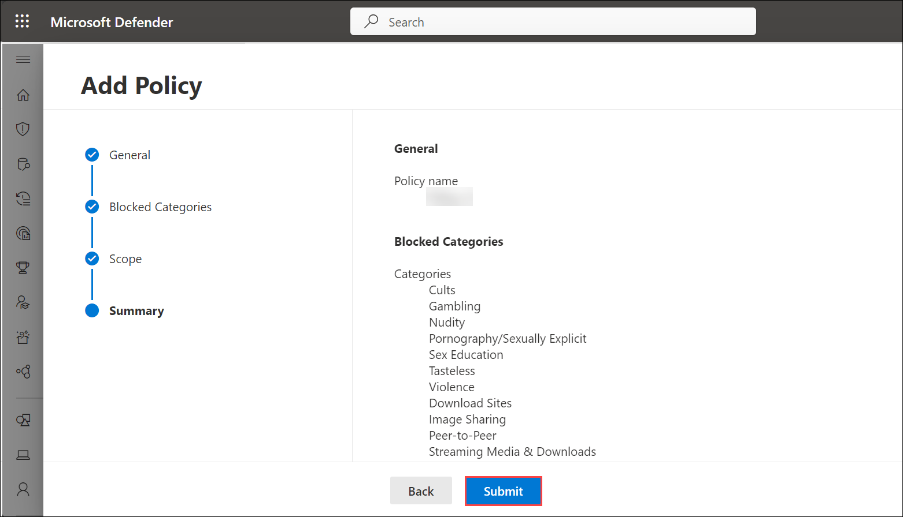

### Task 3: Testing Web Content Filtering policy

1. Open an In-private browsing window and visit the following URLs: **store.steampowered.com** and **roundcube.net**.

1. View the results, which indicate that network protection is enabled, and web content filtering is set to block the '**games**' category and **web-based mail**.

    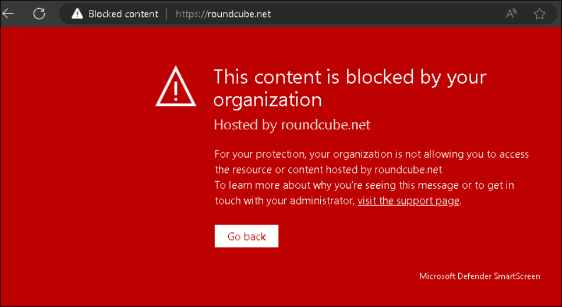

    

    >**Note:** If the output does not appear as expected, please be patient and wait for some time; it should eventually match your expectations.

### Task 4: Explore Automatic Investigation and response (AIR) 

1. Navigate back to the **Microsoft Defender portal**. From the left navigation pane select **Permissions**, under **Endpoints roles and groups**, select **Device groups**.

1. Select **+ Add device group**.

1. On **Add device group** page, Create at least one device group, as follows:

    - Specify a **name** and **description** for the device group.
    - In the Automation level list, select a level, such as **Full - remediate threats automatically**. The automation level determines whether remediation actions are taken automatically, or only upon approval. To learn more, see Automation levels in automated investigation and remediation, and select **Next**.
    - On the **Devices** category, under the **OS** status, choose the **Value** drop-down menu, and opt for **Windows Server 2019 (1)** from the available options. Select **Next (2)**.

        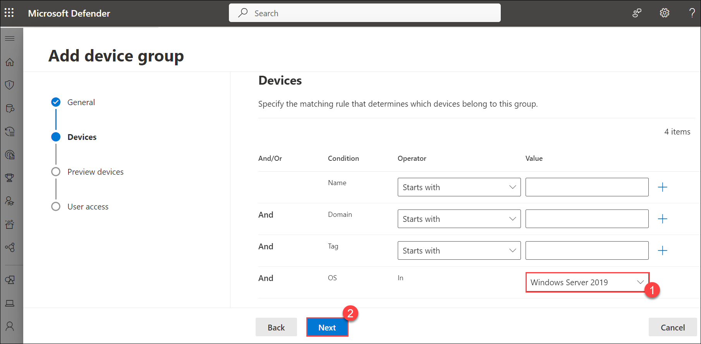

    - On **Preview devices** page, select **Show preview (1)**, and it will show the device which matches groups. Select **Next (2)**.

        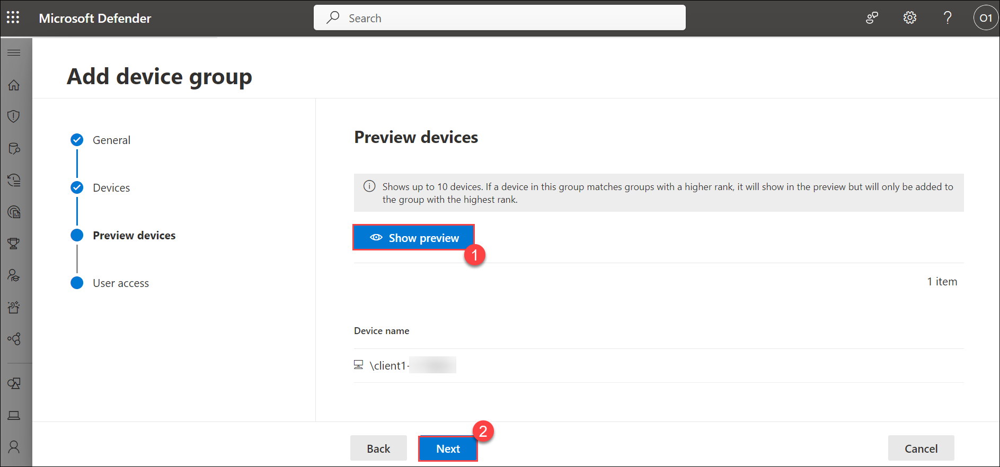

    -   On **User access** page, select the checkbox of the group, select **Add selected groups**, and select **Submit**. Select **Done** once completed.

1. From the left-navigation menu, select **Actions & submissions**, select **Action center**.

1. Use the **Pending** and **History** tabs. The following table summarizes what you'll see on each tab:

    |Tab|Description|
    |---|-----------|
    |**Pending**|Displays a list of actions that require attention. You can approve or reject actions one at a time, or select multiple actions if they have the same type of action (such as Quarantine file).|
    |**History**| Serves as an audit log for actions that were taken, such as:
    
    - Remediation actions that were taken as a result of automated investigations
    - Remediation actions that were approved by your security operations team
    - Commands that were run and remediation actions that were applied during Live Response sessions
    - Remediation actions that were taken by threat protection features in Microsoft Defender Antivirus
    

1. To customize, sort, filter, and export data in the Action center, take one or more of the following steps:

    - Choose the columns that you want to view (1).
    - Specify how many items to include on each page of data (2).
    - Use filters to view just the items you want to see (3).
    - Select Export to export results to a .csv file (4).

        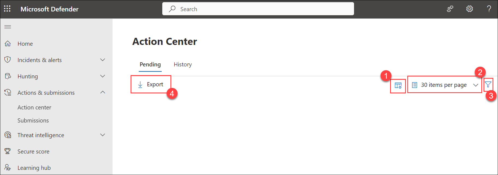

1. Review the items on the **Pending** tab.

1. Select an action to open its flyout pane.

1. In the flyout pane, review the information, and then take one of the following steps:

    - Select **Open investigation** page to view more details about the investigation.
    - Select **Approve** to initiate a pending action.
    - Select **Reject** to prevent a pending action from being taken.
    - Select **Go hunt** to go into **Advanced hunting**.

1. For incidents with a remediation status of **Pending approval**, you can also approve or reject a remediation action from within the incident. In the left-navigation pane, go to **Incidents & alerts > Incidents**.

1. Select an incident name to open its summary page.

1. Select the **Evidence and Response** tab.

1. Select an item in the list to open its flyout pane.

1. Review the information, and then take one of the following steps:
    
    - Select the Approve pending action option to initiate a pending action.
    
    - Select the Reject pending action option to prevent a pending action from being taken.

1. Now, review the items on the **History** tab.

1. Select an item to view more details about that remediation action.

## Review

In this lab, you have completed the following:

- Created Attack Surface Reduction Rules  
- Configured Web Content Filtering 
- Tested Web Content Filtering policy 
- Explored Automatic Investigation and response (AIR)

## You have successfully completed the lab.